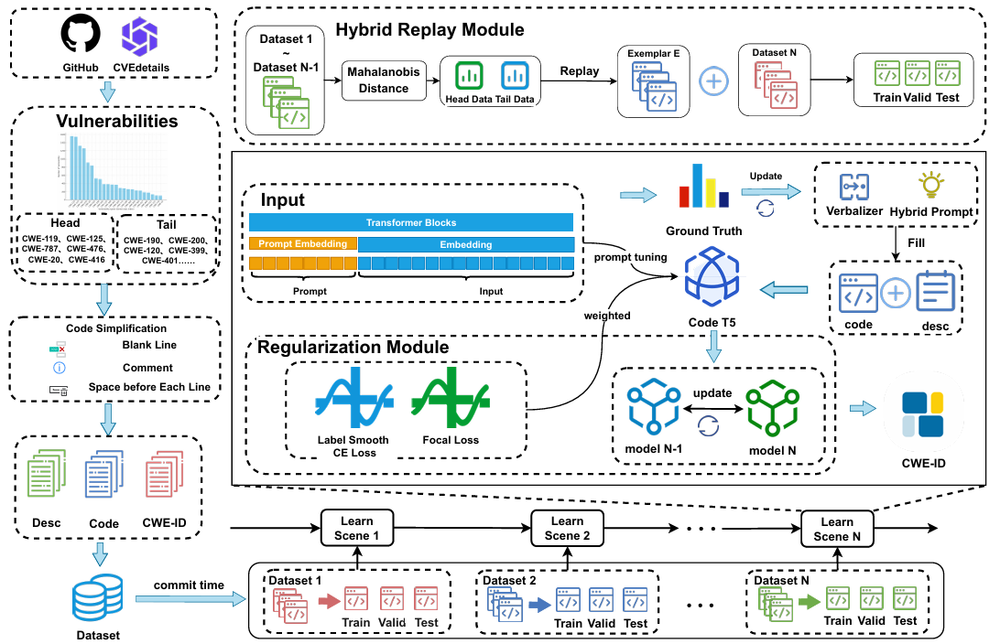

# Learning Never Stops: Improving Software Vulnerability Type Identification via Incremental Learning

This is the source code to the paper "Learning Never Stops: Improving Software Vulnerability Type Identification via Incremental Learning". Please refer to the paper for the experimental details.

## Approach

## Datasets

###  Download Dataset
[Download from Cloud Drive](https://drive.google.com/drive/folders/1FMJDuZd9B05mD5dQYlPCQaHvY8JURyZm)

1、cve_with_graph_abstract_commit.json

2、svti.json

3、svti_simple.json

###  Statistics of our dataset

|                                  |      C/CPP     |      Java     |  
|----------------------------------|:--------------:|:-------------:|
| Number of Repositories           |      1062      |      362      | 
| Number of CVE IDs                |      8476      |      775      |    
| Number of CWE IDs                |      176       |      115      |   
| Number of Commits                |      9288      |      902      |   
| Number of Vul/Non-Vul Function   |  17975/335898  |  2433/39516   | 
| Success Rate of Graph Generation |      87%       |     100%      |    

### License

Our dataset is licensed under the GPL 3.0, as found in the [LICENSE](LICENSE.txt) file.

## Requriements
You can install the required dependency packages for our environment by using the following command: pip install - r requirements.txt.

## Data preprocess
Simulate our dataset into a continuous stream. Like we split our original dataset into five tasks.

## Reproducing the experiments:
1.Use the py file under ``data crawling and processing`` for data processing. Of course, you can directly use the ``dataset`` we have processed: [Google Drive Link](https://drive.google.com/drive/folders/1P42XsDWeMqAW33oS0gGamXEqxYiMjO5i?usp=drive_link)

2.Run ``VulTypeIL.py``. After running, you can retrain the ``model`` and obtain results.

3.You can find the implementation code for the ``RQ1-RQ5`` section and the ``Discussion`` section experiments in the corresponding folders. 

## Pre-trained model
You can obtain our saved model and reproduce our results through the <a href="https://drive.google.com/drive/folders/1GuchdeFsGUKh8tvCles9kcjIcC-loD5v">model link</a>
